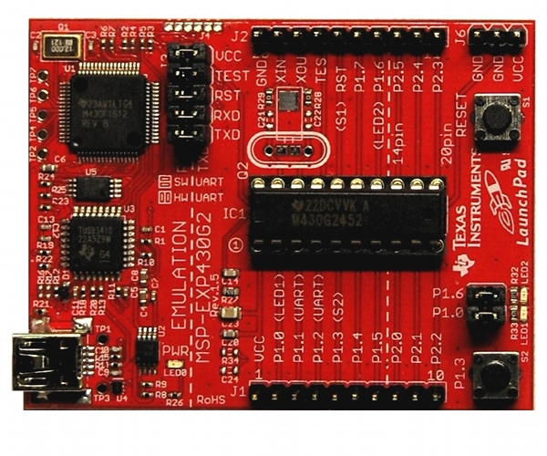

# msp-exp430G2

This project is targeted at the development of various code examples for the
[MSP430 LaunchPad Revision 1.5] (http://www.ti.com/tool/msp-exp430g2#2) by
Texas Instruments with the MSP-GCC toolchain while automating the setup
process of a development environment with VirtualBox and Vagrant.



## Requirements

* [VirtualBox](https://www.virtualbox.org)
* [VirtualBox Extension Pack](http://download.virtualbox.org)
* [Vagrant](http://vagrantup.com)

### Bootstrapping the Virtual Development Machine

```
git clone https://github.com/h5b/msp-exp430G2.git
cd msp-exp430G2
git submodule init
git submodule update
vagrant up
```

This sets up a virtual development machine host __msp430-dev__ based on Ubuntu
12.04. with the MSP-GCC toolchain already being installed.
The setup takes a couple of minutes. After the installation has finished you
can login to the machine by running: `vagrant ssh`

## Code Examples

* [blink_led_pwm](src/blink_led_pwm)
  implements an PWM example to flash the Green User LED of the MSP430 LaunchPad.
  Flashing the LED is accomplished by making use of Timer_A's ability to keep
  track of two Compare Match Values. With one being used as PWM Duty Cycle and
  the other one to control the PWM Period.

* [blink_led_sw](src/blink_led_sw)
  implements an example to let the Green User LED of the MSP430 LaunchPad blink
  once per second. The delay is accomplished via a software delay provided by
  __\_\_delay_cycles()__ function.

* [blink_led_timerA](src/blink_led_timerA)
  implements an example in the veins of [blink_led_wdt]
  (src/blink_led_wdt) to let the
  Green User LED of the MSP430 LaunchPad blink once per second.
  Instead of utilizing the Watchdog functionality the System Timer_A is
  configured to run in Compare Match Mode.

* [blink_led_wdt](src/blink_led_wdt)
  is an example in the veins of [blink_led_sw]
  (src/blink_led_sw) to let the
  Green User LED of the MSP430 LaunchPad blink once per second.
  Although using a timer-based delay which is accomplished via the builtin
  Watchdog functionality.

* [led_pwm](src/led_pwm)
  is an (very rough) example of Brightness Control of the Green User LED of the
  MSP430 LaunchPad via PWM. Timer_A is configured to run in dual Compare Match
  Mode. Stepping of the PWM Duty Cycle uses a simple Lookup Table of exponential
  PWM Values as the human eye senses brightness approximately logarithmically
  over a wide range.

### Running Code Examples

Ensure that mspdebug is ready to recognise the Launchpad.
The best approach here is to plug in the board not before
`vagrant up` has finished. If you encounter any problems
have a look at the output of running `lsusb` which should
result in:

```
vagrant@msp430-dev:~$ lsusb
[..]
Bus 002 Device 002: ID 0451:f432 Texas Instruments, Inc. eZ430 Development
Tool
```

The following steps show how to program and run the
[led_pwm](src/led_pwm)
example:

```
vagrant ssh
cd /vagrant/src/led_pwm
make prog
```
